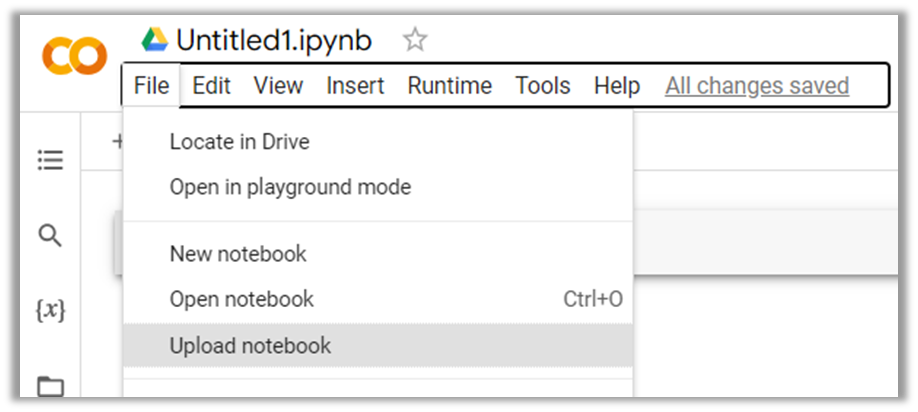
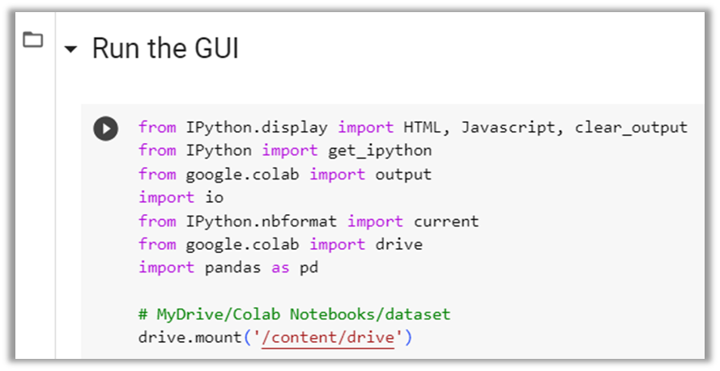
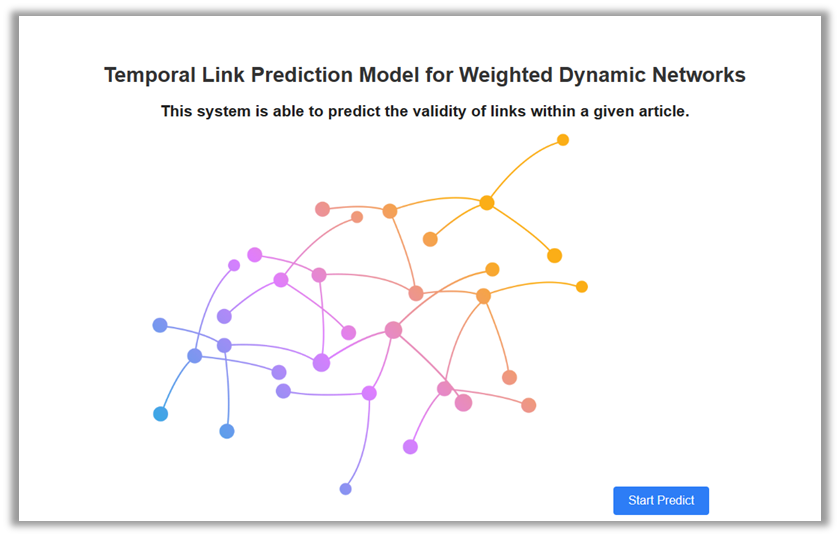
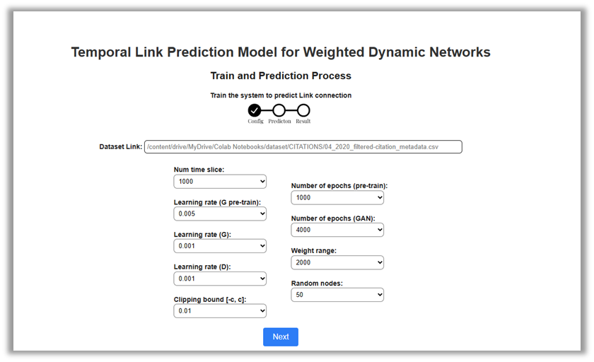
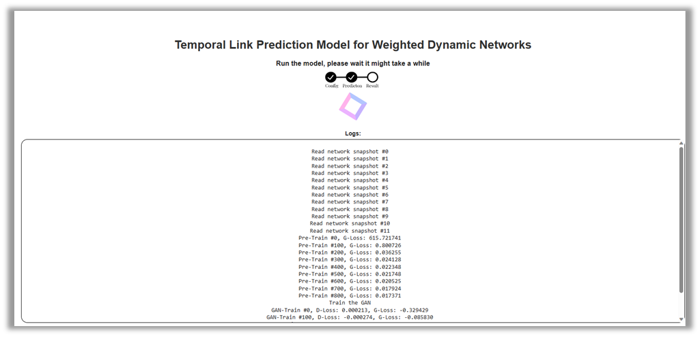
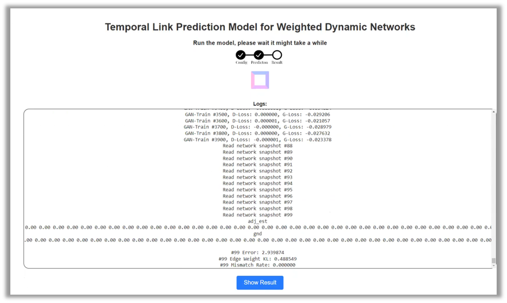
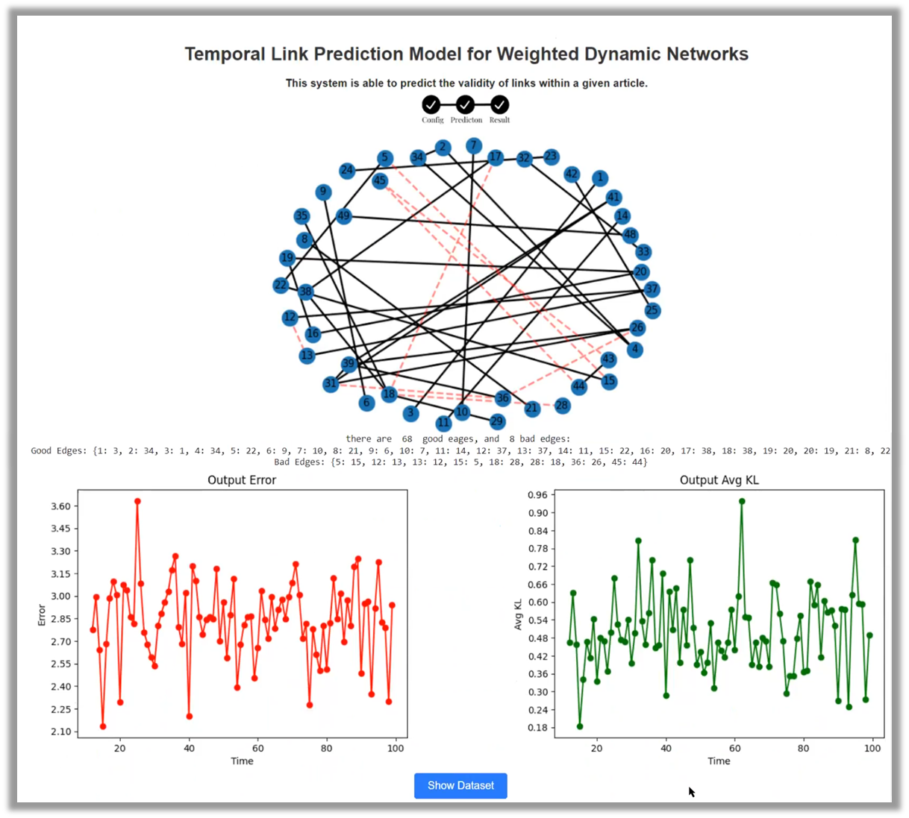
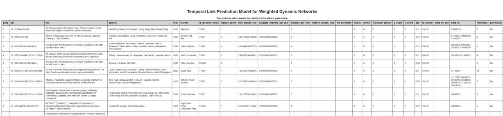

# Temporal-Link-Prediction-Model-for-Weighted-Dynamic-Networks

Welcome to our Final project on Temporal Link Prediction Model for Weighted Dynamic Networks.

## Table of Contents

- [Installation](#installation)
- [Description](#Description)
- [Data](#data)
- [GUI](#GUI)
- [Contributing](#contributing)

## Installation

In this repository, you will find two files of Python code: `GCN-GAN_TempLinks-articel.py` and `GCN-GAN_TempLinks-articel.ipynb`. We recommend using Google Colab or Kaggle to run the model. If you prefer to run the code locally on your computer without a GUI, you can download the file in `GCN-GAN_TempLinks-articel.py` format.

To get started, please follow these steps:

1. Clone the repository to your local machine.

   ```
   git clone https://github.com/TalChenBE/Temporal-Link-Prediction-Model-for-Weighted-Dynamic-Networks.git
   ```

   OR
   [Click Here](https://colab.research.google.com/drive/1uYycL1YnswQq_dlGAkZTz_UG8jFcEYjK?usp=sharing) to view the notebook in Google Colab.

2. If you are using Google Colab or Kaggle, upload the `GCN-GAN_TempLinks-articel.ipynb` file to the platform and open it in the respective environment:

   - Create a new blank notebook in Google Collab or Kaggle and subsequently import/upload the project's notebook:
     

   And that it you all set up.

   - To run the GUI:
     Navigate to the "Run the GUI" section and click on the play button. By doing so, the subsequent screen, known as the home page, will be displayed.
     

3. If you want to run the code locally, make sure you have Python installed on your machine in version 3.10.12, and tensorflow in version 2.12.0. Then, navigate to the project directory and execute the following command:
   ```
   python GCN-GAN_TempLinks-articel.py
   ```

## Description

In this project, you will find the following components:

- _Python code_: We provide both a Jupyter Notebook (`GCN-GAN_TempLinks-articel.ipynb`) and a regular Python file (`GCN-GAN_TempLinks-articel.py`) containing the code for our project. Choose the appropriate file based on your preferred environment (Google Colab/Kaggle or local machine as mentioned in the [Installation](#installation)).

- _Capstone Project Phase B–23-1-R-15.pdf:_ Research Book We have documented our research findings in a book format. Please refer to this document for a detailed understanding of our project, including the methodology, experiments, and results.

- _Capstone Project Phase B–23-1-R-15.pptx:_ Project Presentation- We have prepared a presentation to showcase our project. You can find it in the repository for an overview of our work.

- _Research Results:_ The results of our experiments are presented in the research book. We encourage you to explore the findings to gain insights into our temporal link prediction model for weighted dynamic networks. You also can visit our [drive](https://drive.google.com/drive/folders/1tU86VFSKbcydsbscgCU0IXZ6OIWC2nqh?usp=sharing) to view the results

- _utils:_ The utils of the project contain the algorithm to reduce the iCite dataset as mentioned in our article. The algorithm (`iCite-reduce-dataset.ipynb`) to reduce the dataset, if you are using Google Collab or Kaggle, then you may need to reduce the dataset. if so you can run this algorithm on your dataset. Note: if you want to reduce the model to its maximum you need to run the model until the output is the same.

- _Datasets:_ The dataset of the project, cntains the Reduced iCite Dataset, and UCSB Dataset. Go to [Data](#data) section for more understanding about each one of the files.

- _assets:_ The assets of the project, cntains the images for the readme file.

## Data

Our project relies on specific datasets to perform temporal link prediction in weighted dynamic networks. The datasets used in this project are available at [figshare](https://nih.figshare.com/search?q=:keyword:%20%22Citation%20data%22). Please download the required datasets and ensure they are properly formatted for compatibility with the project code.

If you want to use your own datasets, make sure they follow the required format specified in the project documentation. You can also explore the provided sample data to understand the structure and format of the input data.

In this repository, you will find two datasets:

1. Reduced iCite Dataset: We have provided a reduced dataset that we used to implement and evaluate our model. This dataset is specifically tailored for our project and serves as an example for running the model.

2. UCSB Dataset: Additionally, we have included the UCSB dataset, which is referenced in our article. This dataset is widely used in the research community and provides a comprehensive collection of real-world data for link prediction tasks.

Please note that both datasets are included for illustrative purposes and to showcase the functionality of our model. If you wish to use your own datasets, please ensure they adhere to the required format and structure as described in the project documentation.

Feel free to explore and use these datasets to run the model and validate its performance.

## GUI

Generally, the system relies on deep learning and is created to forecast connections between articles. User can click "start predict" in order to begin the prediction process with the default dataset named iCite metadata dataset.

The user is required to insert a link to the dataset -or- to place the dataset in the path that appears in the placeholder of the `Dataset Link`, in addition, can select different values for each of the model's parameters. Once the configuration is complete, clicking on the "Next" button initiates an immediate start to the prediction process.

Within this window, the user can view the logs of the ongoing prediction process.

Toward the end of the logs, the results of the last iteration will be displayed, including the error, edge weight KL, and mismatch rate. In addition, the user can view the result by scrolling inside the logs window. Once the process is complete, a new button is paper and the users have the option to click the "show results" button, which will open the charts depicting the prediction results.

Within this screen, users have the ability to visualize all the results through charts.

Towards the conclusion of this screen, users have the option to click on the "Show dataset" button to access the entire dataset, displayed in a table format, before any reduction or modification.


## Contributing

We welcome contributions to enhance the functionality and usability of our project. If you would like to contribute, please follow the guidelines below:

- Fork the repository and create a new branch for your feature or bug fix.
- Ensure your code adheres to the project's coding standards.
- Submit a pull request, clearly describing the changes you have made.

For bug reports or feature requests, please open an issue on the repository's issue tracker. We appreciate your feedback and contributions!

```
Tal-Chen Ben-Eliyahu, Lior Karish. (2023). Temporal Link Prediction Model for Weighted Dynamic Networks.
```

Please feel free to reach out to us if you have any questions or feedback.

### Hope you find it useful, enjoy! 😃
